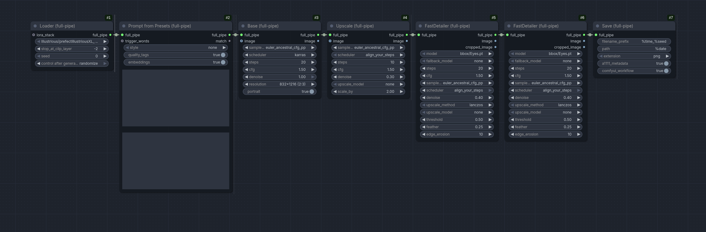

t
# ComfyUI mudknight utils

Nodes to clean up your workflow.



I designed these nodes as an alternative to the `comfyui-easy-use` pipe system. I like easy-use nodes in concept, but I don't like how long it takes to use `pipe-in`, which ruins their flexibility.

I also designed FastDetailer as an alternative to FaceDetailer, with the self-explanatory goal of making a detailer that's faster.

## Nodes

### Full Pipe
A full pipe can either be made with the `Loader (full-pipe)` node or manually with `full pipe pack`. The pipe functions as the only necessary connection between discrete sections of a workflow, storing all necessary data.

The main differences between easy use pipes and full pipes are:
- Full pipes store additional information, like `ckpt_name`, `positive_text`, and `negative_text`
- Easy use's pipe in node takes ~5 seconds to run, compared to full pipe in which is almost instantaneous.
- Less ambiguity with the seed input.

### Loader (full-pipe)
Loads a selected checkpoint, sets CLIP skip, sets a seed, and optionally applies a LoRA stack from the input.

### Prompt from Presets (full-pipe)
This node does a lot. It looks at 3 files to automatically add things to the prompt, which are:

#### Models
Checks `config/models.json` for model-specific tags/embeddings and applies them based on the parent directory of the checkpoint. The json is formatted like this:
```
{
    "Illustrious":
        "quality": {
            "positive": "best quality, absurdres"
            "negative": "lowres, worst quality"
            },
        "embeddings": {
            "positive": "embedding:Smooth_Quality"
            "negative": "embedding:Smooth_Negative-neg"
        }
}
```

There are additional toggles on the node for selectively toggling quality tags and embeddings.

#### Style
Checks `config/styles.json` for style tags and applies them when selected from `styles`

#### Characters
Checks `config/characters.json` for character tags and replaces used json keys with values. Here's an example.
```
{
    "gotoh hitori": {
        "character": "gotoh hitori, blue eyes, long hair, pink hair, one side up, hair between eyes, cube hair ornament, hair over eyes",
        "top": "pink jacket, track jacket",
        "bottom": "grey skirt, pleated skirt"
    },
}
```

Using `gotoh hitori` in the prompt will replace it with all of the `character` tags defined in the file. The tags `top` and `bottom` will also be replaced with their respective values.

### Base (full-pipe)
This is the base image generation node. By default it will use an empty latent with the dimensions defined by the node, but it also has an `image` input and `denoise` parameter for img2img generation.

### Upscale (full-pipe)
This is an upscaling node that uses simple lanczos scaling and sampling. I've never found that an upscale model is necessary, so it's not included in the node.

### FastDetailer
The FastDetailer nodes are an alternative to FaceDetailer that are intended to be faster and more detailed, at the (potential) cost of cohesion with the rest of the image. It simply crops a region, upscales it to 1MP, samples the image, scales it back down to its original size, and uncrops it. The `bbox_fallback` model will run if no SEGS were detected with the primary model, with the use-case to be used with models like `full_eyes_detect_v1.pt` and `Eyes.pt` as a fallback if only one eye is detected.

`FastDetailer (full-pipe)` uses `full_pipe`, as the name implies.

These nodes currently depend on other nodes from impact-pack and easy-use. I'd like to move away from these in the future, but I wanted to make this now to add SEGS iteration, which is a pain to set up with subgraphs.

### Save (full-pipe)
This node saves the image with the ComfyUI workflow and A1111 metadata. I use a tool on my images that pulls the A1111 prompt (since pulling a prompt from a comfy workflow isn't standardized in any way), so that's the main focus of the node.
